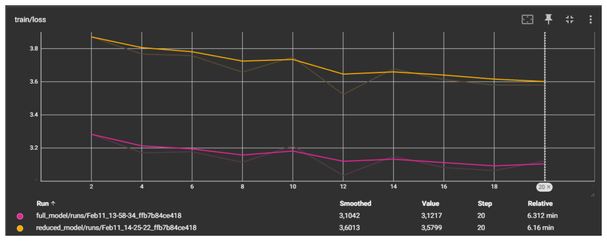
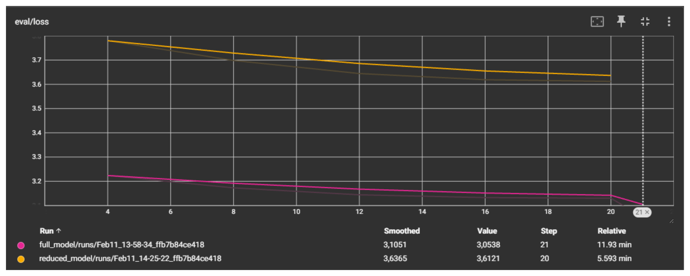

# ReadMe File

This ReadMe file discusses the task at hand, my implementation as well as design choices, and lastly gives a small summary of the results.

## Setup 
Since my PC is a literal potato, I had to rely on notebooks and Google Colab to run the tasks. Therefore the setup is straight forward and you simply have to run through the notebook. Everything should work as is. 

## Implementation and Design Choices

### 1. Data Collection
For collecting the press releases I chose to go with the RSS feed BMW provides as this made the scraping signifcantly easier. I received the press items through the feed and then had to visit the website through the provided link to access the full text of an article. 

To clean the data further, as there were quite a few noisy elements, I first split the paragraphs to keep the structure, and then split the sentences to their elements to get rid of all noise. I also ignored tables where possible as their format is not ideal for training data. I decided to save the data as .parquet as this offered great compression for the long strings. 

### 2. Data Preparation
I chose to use only a small amount of press releases as the training was extremely low as is and I was struggeling to finish even a full epoch with the computing time that I have avaiable. Therefore, taking a very small dataset made sense, but the general setup should scale quite well. 

The split follows a simple 80/10/10 ratio. Others would also be viable but the exact choice is not critical for a proof of concept like this one. A text column was created to adhere with the standard HF conventions and all other (unused) columns were deleted. A small max_length was used for efficiency and the datasets were shuffled respectively after being tokenized. 

### 3. Model choice and Training
Qwen3 was the model of my choice as I have made good experiences with it in the past and I just generally like it. First, I tried to use the 4B model version but quickly realized that there was no way that I could train that so I made the switch to the 0.6B version. 

The model was made more efficient by using a 4-bit quantization, thus saving memory space. Additionally I decided to try out QLoRA to make the training even more efficient. I went with the standard AdamW Optimizer but a quantized version could have also been a possibility. 

I decided to use the HuggingFace libraries in general as they, in my opinion, provided the ideal abstraction level needed for this task. There is no reason to implement everything in pytorch here. 

For the reduced model the last layer, was removed completely bringing it down from 28 to 27 layers in total. There is a discussion to be had which layer would be the best for removal. From literature it seems like middle layers are another valid candidate while the input layers, according to the general consensus, should go untouched. In this case I decided to remove the last layer but in a more extensive project this is something to test for. 

The training was conducted for only one epoch with plenty of evaluation and logging steps. There was no real hyperparameter fine-tuning conducted in this case.

### 4. Results and Discussion
To compare for the perplexity score, I used the untrained model, the trained full model, and the trained reduced model. (The untrained reduced model does not really make much sense as the neuron connection are not adjusted before training).

Let's discuss the Learning Curves:
#### Training Curve

The training curves show that the models are generally learning and validate that the training pipeline is working. The curves are reletively stable, however there is some randomness in the initiation at time that leads to slightly different results and worse learning than seen here. This and the curves in general could definitely be optimized further, but as stated in the assignment perfect curves are not the goal. 

The reduced model is performing significantly worse on an absolute level. But looking at the margin of improvement, it is clear that it is learning quicker than its counterpart. What is intersting though and what I did not expect is that the shape of the training curve is so similar. They have an offset and a different angle, but they have valleys and peaks at the same points. As the datasets were not randomized between the two I suppose that certain samples are the reasons for this behavior. Nonetheless, I did not expect the reaction to be almost the exact same.

___
#### Eval Curve

The eval curves are also stable and validate the overall pipeline. For their absolute value, they are slightly higher than their training counterpart which tracks and altough it is only a few steps there is a clear trend that the model is generalizing quite well. The curves are slightly smoother as the eval steps are less often than the logging steps. 
___
#### Test Perplexity

Perplexity is the gold standard metric for next token prediction. 

Untrained Perplexity: 21.20 \
Full Model Trained Test Perplexity: 19.70 \
Reduced Model Trained Test Perplexity: 35.24

The full model in its trained form outperforms the untrained version on the test set, which again validates the training pipeline. The reduced model performs significantly worse which was expected as the training time was too short for it to recover from the loss of a layer.

#### Text generation and Q&A 
The model performs quite terribly on the small examples. At the same time, it is clear that some new information has flown into it. It is actually quite funny to go through a few of the results, as there definitely is some creativity especially with naming. However, it was quite clear that with such little training time there is little to no useful output.  

## Summary
In this notebook I demonstrate how a fine-tuning can be performed for company-specific data. In my opinion, the pipeline clearly shows that it is functioning with meassurable improvements in metrics and relatively stable behavior. The reduced model did receive a relatively large shock from the removal of a layer, but it is recovering quite quickly. 

There is still a lot of optimization potential, which can be acchieved through more time and more compute. The most obvious improvements would be: More data, larger model, longer training, and hyperparameter tuning. Less obvious options are: mixing in original training data to reduce the risk of catastrophic forgetting, and choosing a quantized optimizer. To fully assess the validity of the reduced model, longer training would be needed. I am unfortunately quite limited by my hardware, so this was simply not possible.

If you made it to here, thank you for reading it all. I hope that you've enjoyed this little right up and had some fun looking at some of the generated results!